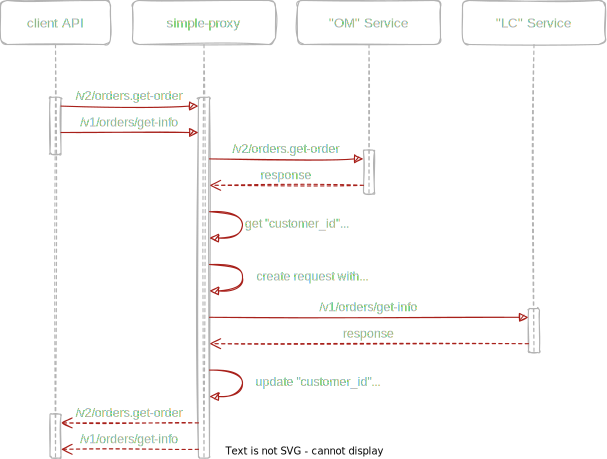
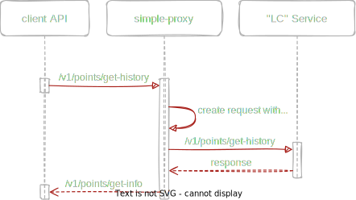

# Simple-proxy

An integration testing tool that allows the client API:
1. Display details of the requested order
2. Display point history for the requested user

## 📌 Target
It is used when working with the client API service as a proxy between target microservices

### Main task:



Example of the request body for the `LC` service, for which the `customer_id` parameter is being replaced:
```json
{
    "params": {
        "customer_id": 1234567890,
        "order_number": "AD700-3970"
    }
}
```

Example of a response body from the `OM` service, for which the `customer_id` parameter is read and replaced:
```json
{
  "result": {
    "customer": {
      "customer_email": "user@integration.test",
      "customer_id": 1234567890
    },
    "items": [
      {
        "label": "Product label",
        "sku": "3VRS14858383D",
        "quantity": 1,
        "price": "37.00"
      }
    ]
  }
}
```
### Secondary task:


Example of the request body for the `LC` service, for which the `customer_id` parameter will be replaced:
```json
{
    "params": {
        "customer_id": 1234567890,
        "limit": 10
    }
}
```
## 📦 Build
Cross-platform build:
```shell
make build
```
Building for AMD64 architecture:
```shell
make build-amd64
```
Building a Docker-image:
```shell
make build-docker
```
Образ: `la/simple-proxy:latest`

## 🚗 Launch (linux/macOS)
The command to run:
```shell
./simple-proxy
```
The proxy accepts the following arguments as input:
```
Usage of ./simple-proxy:
  -c int
        Customer ID to replace
  -ch int
        Customer ID to request lc history
  -lc string
        Lc service URL (default "http://lc-test.stage2.com")
  -om string
        Orders service URL (default "http://orders-test.stage2.com")
  -p int
        Proxy port number (default 8885)
```
Example of a command to run with arguments:
```shell
./simple-proxy -c=1234567890 -ch=1234567890
```
Other arguments are passed as needed

After launching, the proxy is available at: `localhost:8885`

## 🚀 Quick Launch
```shell
make run
```
```shell
make run-docker
```
The arguments to run are configured in the `Makefile`


## 🛠 Configuring settings
The service has an API for quickly changing parameters during operation, the available methods are described in `specs/swagger.yaml`

*Method `/update_customer_id` - used for "Postman" as a "Pre-request Script", example:
```javascript
var proxyURL = 'localhost:8885'
var customerID = 1234567890

pm.sendRequest({
    method: "POST",
    url: proxyURL + "/update_customer_id",
    header: {
        'Content-type': 'application/json',
    },
    body: {
        mode: 'raw',
        raw: {
            "customer_id_for_history": customerID
        }
    }
});
```


